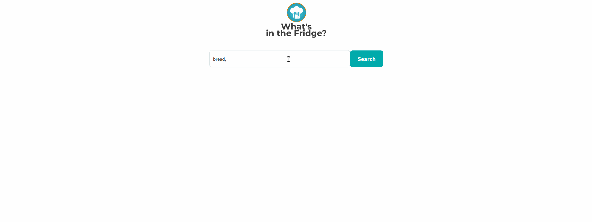

This project was bootstrapped with [Create React App](https://github.com/facebook/create-react-app).

## :file_folder: The Project
**What's in the Fridge** was developed to help you stop wasting time thinking about what you will cook. Now you can just put the ingredients you have or you want in your meal and it will show you some options to cook.

## :rocket: Technologies
It was built using React and it consumes the [Spoonacular API](https://spoonacular.com/food-api/) where you can get a key for free.

## :camera: GIF

## Available Scripts

In the project directory, you can run:

### `npm start`

Runs the app in the development mode. 
Open [http://localhost:3000](http://localhost:3000) to view it in the browser.

The page will reload if you make edits. 
You will also see any lint errors in the console.

## Learn More

You can learn more in the [Create React App documentation](https://facebook.github.io/create-react-app/docs/getting-started).

To learn React, check out the [React documentation](https://reactjs.org/).

### Code Splitting

This section has moved here: https://facebook.github.io/create-react-app/docs/code-splitting

### Analyzing the Bundle Size

This section has moved here: https://facebook.github.io/create-react-app/docs/analyzing-the-bundle-size

### Making a Progressive Web App

This section has moved here: https://facebook.github.io/create-react-app/docs/making-a-progressive-web-app

### Advanced Configuration

This section has moved here: https://facebook.github.io/create-react-app/docs/advanced-configuration

### Deployment

This section has moved here: https://facebook.github.io/create-react-app/docs/deployment
